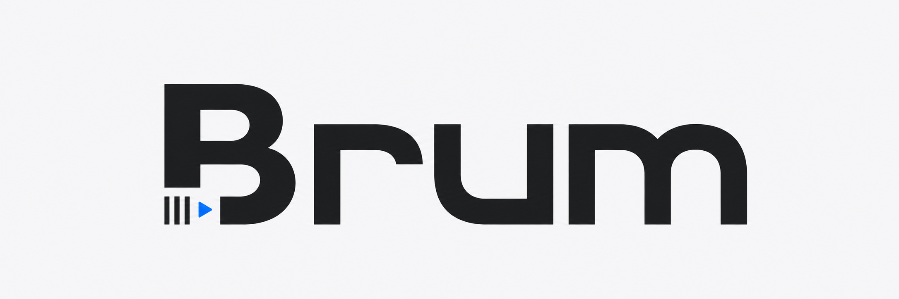

<p align="center">
  
</p>

<p align="center">
  Create forward/reverse boomerang videos to an exact duration, entirely in your browser.
</p>

Brumaire is a mobile-first utility for turning a short video into a forward/reverse boomerang MP4
suitable for an Instagram Story. Select a file, choose a duration or number of boomerang cycles,
process it locally, then save or share the result. One cycle is the source motion forward and then
backward.

## Current status

The core MVP workflow is available at `/tool`:

- Select and preview a local video.
- Extend it to exactly 15, 30, 45, or 60 seconds, or create 2, 3, 5, or 10 complete cycles.
- Preview and download the generated MP4.
- Share the result when the browser supports sharing local files.

Processing happens on-device. Brumaire has no accounts, backend video-processing service, or
intentional video uploads.

> [!IMPORTANT]
> Inputs are currently limited to MP4 files containing exactly one H.264 video track, at most one
> source audio track, and no unrelated tracks. Source audio is intentionally discarded, so generated
> MP4 files are silent. Inputs can be up to 50 MiB and outputs up to 200 MiB. Physical iPhone/Safari
> validation has not yet been performed.

## How it works

Brumaire inspects the visual track, checks browser AVC decode/encode support, decodes video frames
in presentation order, and emits each cycle forward and then backward. The timeline is re-encoded
as AVC/H.264 and muxed into a silent MP4, all locally in the browser; source media is never uploaded.
Exact-duration targets trim the final emitted frame when necessary, while cycle timing always comes
from the video track rather than a longer container or audio tail.

Before retaining decoded frames, Brumaire enforces a 256 MiB decoded-video budget. It also validates
the readable output, duration, codec, geometry, silence, and continuous decoded timeline. CI runs a
Chromium regression that decodes generated output and verifies `A B C D D C B A` playback.

## Stack

- TanStack Start and TanStack Router
- React 19 and TypeScript
- Tailwind CSS 4
- Mediabunny
- Biome
- pnpm

## Local development

Requirements: Node.js 22.12 or newer and pnpm 10.

```bash
pnpm install
pnpm dev
```

The development server runs at `http://localhost:3000`.

## Validation

```bash
pnpm test
pnpm test:browser
pnpm typecheck
pnpm check
pnpm build
```
